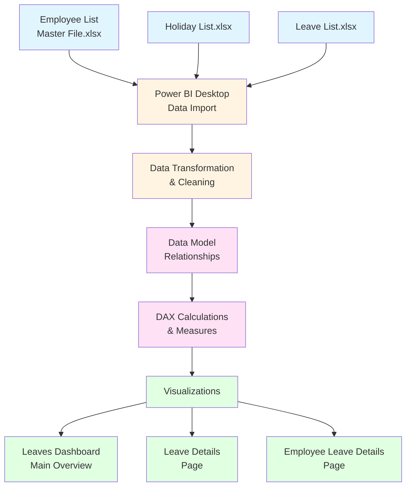
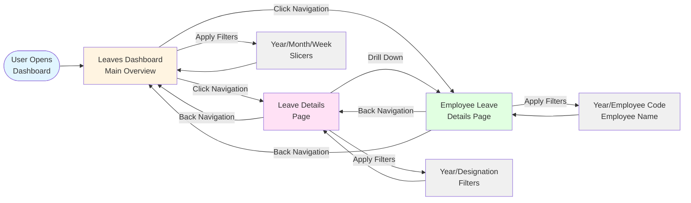
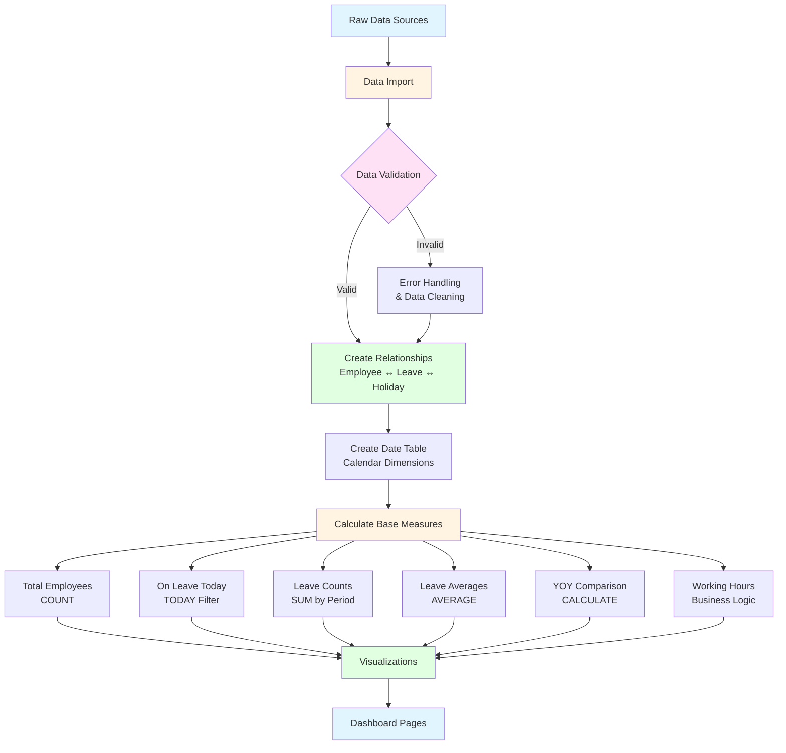
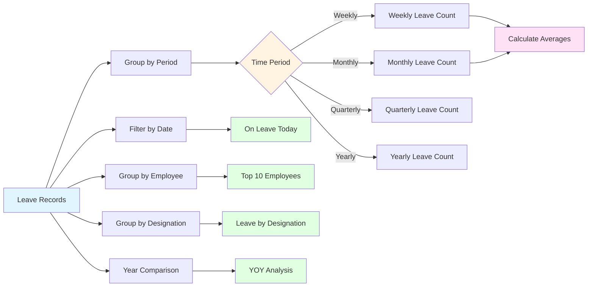

# 📊 Employees Leave Analytics Dashboard – Power BI

A comprehensive, data-driven HR analytics dashboard built using Power BI, designed to analyze employee leave patterns using mock employee and leave data for years 2023–2025. This dashboard provides actionable insights into employee leave trends, helping HR teams and management make informed operational and workforce planning decisions.

## 📋 Table of Contents

- [Overview](#overview)
- [Features](#features)
- [Dashboard Pages](#dashboard-pages)
- [Business Purpose](#business-purpose)
- [Project Structure](#project-structure)
- [Data Sources](#data-sources)
- [Architecture & Flowcharts](#architecture--flowcharts)
- [Getting Started](#getting-started)
- [Usage](#usage)
- [Screenshots](#screenshots)
- [Data Model](#data-model)
- [License](#license)
- [Contributing](#contributing)

## 🎯 Overview

The Employees Leave Analytics Dashboard is a Power BI solution that transforms raw leave data into meaningful visualizations and insights. It enables HR professionals to:

- Monitor real-time leave status
- Analyze leave patterns and trends
- Identify absenteeism patterns
- Support capacity and workforce planning
- Make data-driven decisions about employee leave management

## ✨ Features

### Key Metrics & KPIs
- **Total Employees**: Real-time count of all employees
- **On Leave Today**: Current employees on leave
- **Leave Counts**: Weekly, Monthly, Quarterly, and Yearly aggregations
- **Averages**: Weekly and Monthly leave averages
- **Year-over-Year (YOY) Comparison**: Trend analysis across years
- **Working Hours & Effective Hours**: Productivity metrics

### Interactive Elements
- **Time-based Slicers**: Filter by Year, Month, and Week
- **Designation Filters**: Analyze leave patterns by job role
- **Employee Search**: Find specific employee leave records
- **Sortable Tables**: Dynamic data exploration

## 📑 Dashboard Pages

### 1. Leaves Dashboard (Main Overview)
The primary dashboard page providing a comprehensive overview of leave analytics:

- Total employees count
- Employees on leave today
- Weekly, Monthly, Quarterly, and Yearly leave counts
- Weekly & Monthly averages
- Year-over-Year (YOY) comparison
- Working hours and effective hours metrics
- Interactive slicers: Year, Month, Week

### 2. Leave Details
Detailed analysis of leave patterns and trends:

- Monthly leave trend visualization
- Leave count breakdown by designation
- Top 10 employees by leave days
- Employee-level leave details table
- Filters: Year & Designation

### 3. Employee Leave Details
Individual employee leave analysis:

- Monthly leave trend (week-based visualization)
- Employee-level sortable table with:
  - Employee Code
  - Employee Name
  - Designation
  - Leave Days
- Filters: Year, Employee Code, Employee Name

## 🎯 Business Purpose

This dashboard helps HR teams:

- **Monitor Leave Activities**: Track real-time and historical leave data
- **Identify Patterns**: Discover trends in absenteeism and leave utilization
- **Support Planning**: Make informed decisions about capacity and workforce planning
- **Improve Operations**: Optimize leave policies and resource allocation
- **Data-Driven Decisions**: Base HR strategies on quantitative insights

## 📁 Project Structure

```
PowerBi-Leaves-Dashboard/
│
├── Dashboard/
│   └── Employees Leaves Dashboard.pbix    # Main Power BI dashboard file
│
├── DataSource/
│   ├── Employee List - Master File.xlsx   # Employee master data
│   ├── Holiday List.xlsx                  # Company holidays data
│   └── Leave List.xlsx                    # Employee leave records
│
├── Docs/
│   ├── Data Model.png                     # Data model visualization
│   └── Purpose of Dashboard.docx          # Detailed documentation
│
├── Screenshots/
│   ├── Dashboard Overview.png             # Main dashboard screenshot
│   ├── Employee Details.png               # Employee details page screenshot
│   └── Leave Details.png                  # Leave details page screenshot
│
├── LICENSE                                # MIT License
└── README.md                              # This file
```

## 📊 Data Sources

The dashboard uses three primary Excel data sources:

1. **Employee List - Master File.xlsx**
   - Contains employee master data including codes, names, designations, and other employee attributes

2. **Holiday List.xlsx**
   - Contains company holidays and non-working days

3. **Leave List.xlsx**
   - Contains individual leave records with dates, employee information, and leave details

> **Note**: The current dataset contains mock data for years 2023–2025 for demonstration purposes.

## 🏗️ Architecture & Flowcharts

### Data Flow Architecture

The following flowchart illustrates how data flows from Excel sources through Power BI to the final dashboard visualizations:



### Dashboard Navigation Flow

This flowchart shows how users navigate through different dashboard pages and interact with filters:



### Data Processing & Calculation Flow

This flowchart illustrates how raw data is processed and calculated metrics are generated:



### Key Calculations Overview

The dashboard performs the following key calculations:



## 🚀 Getting Started

### Prerequisites

- **Power BI Desktop**: Download and install [Power BI Desktop](https://powerbi.microsoft.com/desktop/) (free)
- **Microsoft Excel**: For viewing/editing data source files (optional)

### Installation

1. **Clone or download this repository**
   ```bash
   git clone <repository-url>
   cd PowerBi-Leaves-Dashboard
   ```

2. **Open the Dashboard**
   - Navigate to the `Dashboard/` folder
   - Double-click `Employees Leaves Dashboard.pbix` to open in Power BI Desktop

3. **Refresh Data Sources** (if needed)
   - In Power BI Desktop, go to **Home** → **Refresh**
   - Ensure the data source paths are correctly configured
   - The dashboard will automatically load data from the `DataSource/` folder

### Data Refresh

To update the dashboard with new data:

1. Update the Excel files in the `DataSource/` folder
2. Open the `.pbix` file in Power BI Desktop
3. Click **Refresh** or press `Ctrl+R` (Windows) / `Cmd+R` (Mac)

## 💡 Usage

### Navigating the Dashboard

1. **Main Dashboard**: Start here for an overview of all leave metrics
2. **Leave Details**: Click to view detailed leave analysis by designation
3. **Employee Leave Details**: Click to drill down into individual employee records

### Using Filters

- **Time Filters**: Use Year, Month, and Week slicers to focus on specific time periods
- **Designation Filter**: Filter by job role to analyze leave patterns by department/position
- **Employee Search**: Use the Employee Code or Name filters to find specific individuals

### Interacting with Visualizations

- **Hover**: Hover over charts to see detailed tooltips
- **Click**: Click on chart elements to cross-filter other visuals
- **Sort**: Click column headers in tables to sort data
- **Drill-through**: Right-click on data points for additional options

## 📸 Screenshots

Visual previews of the dashboard are available in the `Screenshots/` folder:

- **Dashboard Overview.png**: Main dashboard view
- **Employee Details.png**: Employee-level analysis page
- **Leave Details.png**: Detailed leave analytics page

For a detailed view of the data model relationships, refer to `Docs/Data Model.png`.

## 🔗 Data Model

The dashboard uses a relational data model connecting:
- Employee master data
- Leave records
- Holiday calendar

Refer to `Docs/Data Model.png` for a visual representation of the data model structure and relationships.

## 📄 License

This project is licensed under the MIT License - see the [LICENSE](LICENSE) file for details.

**Copyright (c) 2025 Manjunath S**

## 🤝 Contributing

Contributions, issues, and feature requests are welcome! Feel free to:

1. Fork the repository
2. Create a feature branch (`git checkout -b feature/AmazingFeature`)
3. Commit your changes (`git commit -m 'Add some AmazingFeature'`)
4. Push to the branch (`git push origin feature/AmazingFeature`)
5. Open a Pull Request

## 📝 Notes

- This dashboard uses **mock data** for demonstration purposes
- Data covers the period **2023–2025**
- Ensure Power BI Desktop is updated to the latest version for best compatibility
- Data source paths may need to be updated if files are moved

## 🔧 Troubleshooting

### Common Issues

**Dashboard won't load data:**
- Verify that Excel files are in the `DataSource/` folder
- Check that file paths in Power BI are correctly configured
- Ensure Excel files are not open in another application

**Visuals not updating:**
- Click the **Refresh** button in Power BI Desktop
- Verify data source connections are active

**Missing features:**
- Ensure you're using Power BI Desktop (not Power BI Service)
- Check that all required data sources are present

---

**Built with ❤️ using Power BI**

For questions or support, please open an issue in the repository.
